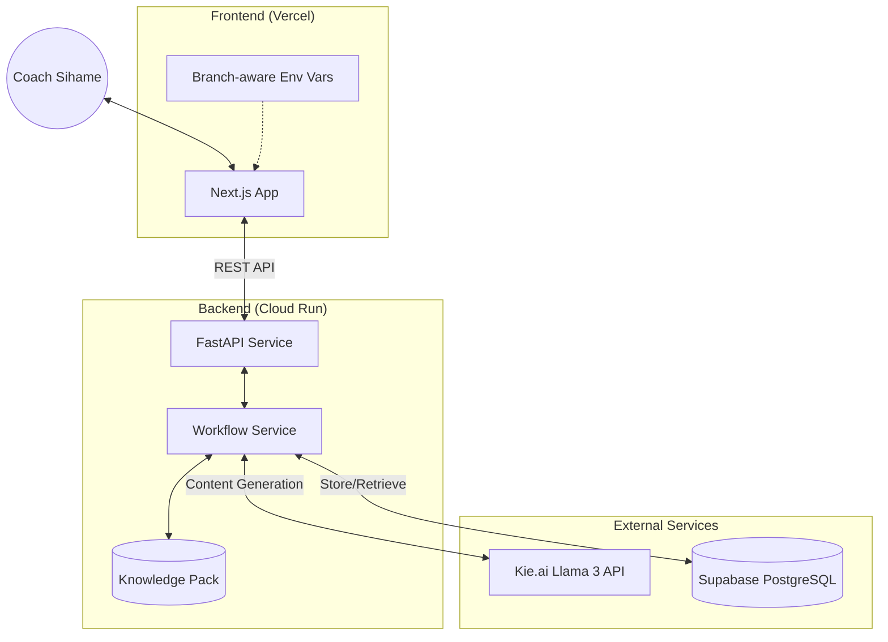

# System Architecture - Sihame Content Engine

This document outlines the high-level architecture of the Coach Sihame Content Engine, detailing how the different components interact to provide a seamless AI content generation experience.

## 🏗️ Architectural Overview

The system follows a modern decoupled architecture with a React frontend, a Python FastAPI backend, and a Supabase database.

## 🔄 The Feedback Loop (Reject & Regenerate)

One of the unique features of this system is the structured feedback loop. Instead of simple 'Delete', rejections are treated as valuable data.

1.  **Generation**: User provides a prompt. The `WorkflowService` assembles brand context from the `KnowledgePack` and calls the AI model.
2.  **Review**: The `DRAFT` is displayed in the UI.
3.  **Rejection**: If the user clicks "Reject", they provide a reason.
    -   The backend calls `/reject`, updating the status to `REJECTED` and saving the `rejection_reason`.
4.  **Regeneration**: The frontend immediately triggers a new generation.
    -   *Future Improvement*: The next iteration can inject the `rejection_reason` into the system prompt to avoid repeating the same mistake.

## 🚢 Multi-Environment Strategy

To maintain stability, we use isolated environments for development and production.

| Component | Production (Branch: `main`) | Development (Branch: `dev`) |
| :--- | :--- | :--- |
| **GCP Project** | `c-sihame-atamnia` | `c-sihame-atamnia` |
| **Backend Service** | `c--sihame-content-engine` | `sihame-backend-dev` |
| **Frontend URL** | [c-sihame-content-engine.vercel.app](https://c-sihame-content-engine.vercel.app/) | [dev-previews](https://c-sihame-content-engine-git-dev-abdo-ais-projects.vercel.app/) |
| **CI/CD** | GitHub Actions (Auto-deploy) | GitHub Actions (Auto-deploy) |

## 🔑 Key Integrations

### 1. Supabase (Database)
Stores the `drafts` table, which includes:
- `id`: Unique identifier.
- `status`: `DRAFT`, `APPROVED`, `REJECTED`.
- `body`: The generated content.
- `rejection_reason`: Feedback text provided by the user.

### 2. Kie.ai (AI Engine)
Utilizes the Llama 3 70b model through a high-performance endpoint, optimized for Arabic creative writing.

### 3. Knowledge Pack
A directory of Markdown files (`ai_writer/knowledge_pack/`) that defines Coach Sihame's unique voice, rituals, and content rules. This is loaded at runtime by the backend.
